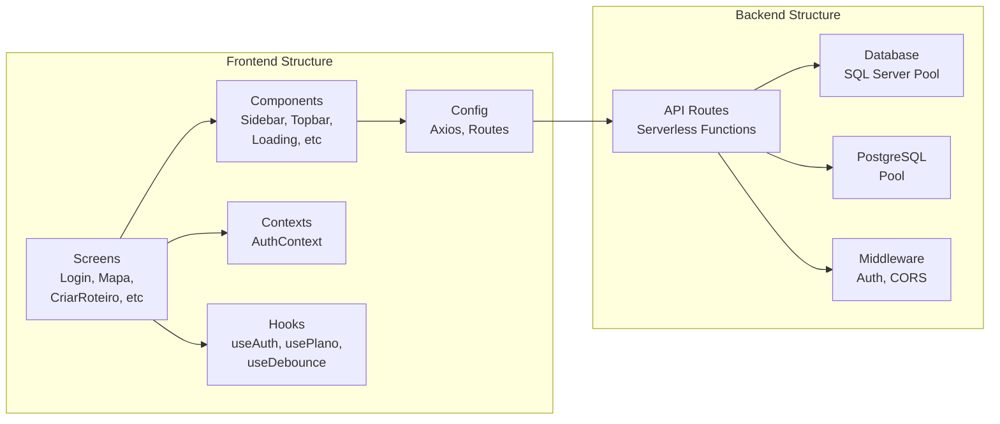

# 🏗️ Arquitetura do Sistema - Colmeia Meus Roteiros

## 📊 Diagrama de Arquitetura

```mermaid
graph TB
    subgraph "🌐 Frontend - React + Vite"
        UI[React App<br/>TypeScript + Tailwind]
        Login[Login Screen<br/>Auth0 Integration]
        Home[Meus Roteiros<br/>Listagem]
        Mapa[Mapa<br/>Leaflet]
        Criar[Criar Roteiro<br/>Wizard Multi-Step]
        Resultados[Visualizar Resultados<br/>Dashboard]
    end

    subgraph "🔐 Autenticação"
        Auth0[Auth0<br/>Identity Provider]
        AuthContext[AuthContext<br/>Auth State]
    end

    subgraph "☁️ Vercel Serverless Functions"
        API[API Routes<br/>Node.js]
        AuthMW[Auth Middleware<br/>JWT Validation]
        DBAPI[Database APIs<br/>SQL Server]
        PostgresAPI[PostgreSQL APIs<br/>Banco de Ativos]
        DatabricksAPI[Databricks APIs<br/>Job Triggers]
    end

    subgraph "💾 Bancos de Dados"
        SQLServer[(SQL Server<br/>Principal<br/>planoMidia_*<br/>roteiros_*)]
        Postgres[(PostgreSQL<br/>Banco de Ativos<br/>media_points<br/>cities)]
    end

    subgraph "⚡ Processamento Externo"
        Databricks[Databricks<br/>Jobs & Notebooks<br/>be180_product_*]
    end

    subgraph "📦 Serviços"
        Vercel[Vercel Platform<br/>Hosting & Functions]
    end

    %% User Flow
    UI --> Login
    Login --> Auth0
    Auth0 --> AuthContext
    AuthContext --> Home
    AuthContext --> Mapa
    AuthContext --> Criar
    AuthContext --> Resultados

    %% API Calls
    Home --> API
    Mapa --> API
    Criar --> API
    Resultados --> API

    %% Authentication
    API --> AuthMW
    AuthMW --> Auth0

    %% Database Connections
    API --> DBAPI
    DBAPI --> SQLServer
    API --> PostgresAPI
    PostgresAPI --> Postgres

    %% External Services
    API --> DatabricksAPI
    DatabricksAPI --> Databricks
    Databricks --> SQLServer

    %% Hosting
    UI --> Vercel
    API --> Vercel

    %% Styling
    classDef frontend fill:#3b82f6,stroke:#1e40af,color:#fff
    classDef backend fill:#10b981,stroke:#059669,color:#fff
    classDef database fill:#f59e0b,stroke:#d97706,color:#fff
    classDef external fill:#8b5cf6,stroke:#7c3aed,color:#fff
    classDef auth fill:#ef4444,stroke:#dc2626,color:#fff

    class UI,Login,Home,Mapa,Criar,Resultados frontend
    class API,AuthMW,DBAPI,PostgresAPI,DatabricksAPI backend
    class SQLServer,Postgres database
    class Databricks,Vercel external
    class Auth0,AuthContext auth
```



## 🔄 Fluxo de Dados Principal

```mermaid
sequenceDiagram
    participant User as 👤 Usuário
    participant Frontend as React App
    participant API as Vercel Functions
    participant Auth0 as Auth0
    participant SQLServer as SQL Server
    participant Postgres as PostgreSQL
    participant Databricks as Databricks

    User->>Frontend: Acessa aplicação
    Frontend->>Auth0: Valida token JWT
    Auth0-->>Frontend: Token válido
    
    User->>Frontend: Cria roteiro
    Frontend->>API: POST /plano-midia-desc
    API->>SQLServer: Insere planoMidiaDesc
    SQLServer-->>API: planoMidiaDesc_pk
    
    Frontend->>API: POST /roteiro-simulado
    API->>SQLServer: Insere dados roteiro
    SQLServer-->>API: Sucesso
    
    Frontend->>API: POST /banco-ativos-passantes
    API->>Postgres: Busca fluxo passantes
    Postgres-->>API: Dados de passantes
    API-->>Frontend: Dados enriquecidos
    
    Frontend->>API: POST /databricks-roteiro-simulado
    API->>Databricks: Trigger job
    Databricks->>SQLServer: Processa dados
    SQLServer-->>Databricks: Resultados
    Databricks-->>API: Job concluído
    API-->>Frontend: Sucesso
    
    Frontend->>API: GET /report-indicadores-*
    API->>SQLServer: Busca resultados
    SQLServer-->>API: Dados agregados
    API-->>Frontend: Dashboard
```



## 📁 Estrutura de Componentes



## 🗄️ Modelo de Dados

```mermaid
erDiagram
    planoMidiaGrupo_dm ||--o{ planoMidiaDesc_dm : "tem"
    planoMidiaDesc_dm ||--o{ planoMidia_dm : "tem"
    planoMidiaDesc_dm ||--o{ consulta_ft : "gera"
    consulta_ft ||--o{ consultaLoop_ft : "tem"
    consultaLoop_ft ||--o{ consultaRecords_ft : "tem"
    consultaRecords_ft ||--o{ baseCalculadoraResult_ft : "gera"
    
    media_points ||--o{ cities : "pertence"
    media_points ||--o{ media_types : "tem tipo"
    
    planoMidiaGrupo_dm {
        int pk PK
        string planoMidiaGrupo_st
        string planoMidiaDescPk_st
    }
    
    planoMidiaDesc_dm {
        int pk PK
        int planoMidiaGrupo_pk FK
        string planoMidiaDesc_st
        string ibgeCode_vl
    }
    
    media_points {
        int id PK
        string code
        decimal latitude
        decimal longitude
        decimal pedestrian_flow
        string social_class_geo
        int city_id FK
    }
```

## 🔐 Fluxo de Autenticação

```mermaid
graph TD
    Start([Usuário acessa app]) --> CheckToken{Token<br/>válido?}
    CheckToken -->|Não| RedirectLogin[Redireciona /login]
    RedirectLogin --> Auth0Login[Login Auth0]
    Auth0Login --> Callback[/callback]
    Callback --> StoreToken[Armazena token]
    StoreToken --> CheckToken
    CheckToken -->|Sim| ProtectedRoute[ProtectedRoute]
    ProtectedRoute --> App[App Principal]
    App --> APIRequest[Requisição API]
    APIRequest --> ValidateJWT[Auth Middleware<br/>Valida JWT]
    ValidateJWT -->|Válido| ProcessRequest[Processa requisição]
    ValidateJWT -->|Inválido| Return401[Retorna 401]
    ProcessRequest --> ReturnData[Retorna dados]
```

## 📊 Fluxo de Criação de Roteiro

```mermaid
graph TD
    Start([Usuário cria roteiro]) --> Tab1[Aba 1: Dados Gerais]
    Tab1 --> Tab2[Aba 2: Target]
    Tab2 --> Tab3[Aba 3: Upload/Praças]
    Tab3 --> Tab4[Aba 4: Roteiro Simulado]
    
    Tab4 --> CreateGroup[Cria planoMidiaGrupo_pk]
    CreateGroup --> CreateDescs[Cria planoMidiaDesc_pk<br/>para cada cidade]
    CreateDescs --> SaveRoteiro[Salva dados roteiro<br/>por cidade]
    SaveRoteiro --> EnrichData[Enriquece com<br/>banco de ativos]
    EnrichData --> TriggerDatabricks[Trigger Databricks Job]
    TriggerDatabricks --> ProcessDatabricks[Databricks processa]
    ProcessDatabricks --> UpdateResults[Atualiza resultados<br/>no SQL Server]
    UpdateResults --> Tab6[Aba 6: Resultados]
    Tab6 --> End([Roteiro completo])
```



## 🌐 Infraestrutura

```mermaid
graph TB
    subgraph "CDN & Edge"
        Cloudflare[Cloudflare CDN]
    end
    
    subgraph "Vercel Platform"
        Edge[Vercel Edge Network]
        Functions[Serverless Functions<br/>Node.js Runtime]
        Static[Static Assets<br/>React Build]
    end
    
    subgraph "Azure Services"
        SQLServer[(Azure SQL Server)]
        Postgres[(Azure PostgreSQL)]
    end
    
    subgraph "Databricks"
        Jobs[Databricks Jobs<br/>be180_product_*]
        Notebooks[Notebooks<br/>Python/Spark]
    end
    
    subgraph "Auth0"
        Identity[Auth0 Identity]
    end
    
    User[👤 Usuário] --> Cloudflare
    Cloudflare --> Edge
    Edge --> Functions
    Edge --> Static
    Functions --> SQLServer
    Functions --> Postgres
    Functions --> Jobs
    Functions --> Identity
    Jobs --> Notebooks
    Notebooks --> SQLServer
```



## 🔧 Tecnologias Utilizadas

### Frontend
- **React 18** - Biblioteca UI
- **TypeScript** - Tipagem estática
- **Vite** - Build tool
- **Tailwind CSS** - Estilização
- **Leaflet** - Mapas
- **React Router** - Roteamento
- **Auth0 React SDK** - Autenticação

### Backend
- **Node.js** - Runtime
- **Express** (via Vercel) - Serverless
- **mssql** - Driver SQL Server
- **pg** - Driver PostgreSQL
- **axios** - HTTP client

### Infraestrutura
- **Vercel** - Hosting & Functions
- **Azure SQL Server** - Banco principal
- **Azure PostgreSQL** - Banco de ativos
- **Databricks** - Processamento
- **Auth0** - Autenticação

## 📡 Principais Endpoints

### Autenticação
- `POST /login` - Login Auth0
- `GET /callback` - Callback Auth0
- `GET /api/user-profile` - Perfil usuário

### Roteiros
- `GET /api/roteiros` - Lista roteiros
- `POST /api/plano-midia-desc` - Cria planoMidiaDesc
- `POST /api/roteiro-simulado` - Salva roteiro simulado
- `GET /api/pivot-descpks` - Pivot de descrições

### Banco de Ativos
- `POST /api/banco-ativos-passantes` - Busca passantes por coordenadas

### Databricks
- `POST /api/databricks-run-job` - Executa job
- `POST /api/databricks-roteiro-simulado` - Job roteiro simulado

### Resultados
- `GET /api/report-indicadores-*` - Vários endpoints de relatórios

---

**Última atualização:** 2025-01-29

