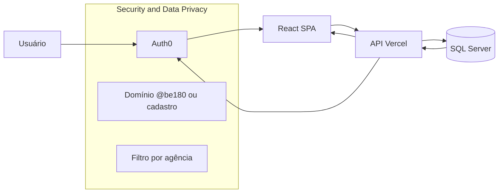

# Atualização do diagrama de arquitetura Colmeia

Documento de referência para atualizar o desenho de arquitetura (ex.: para o Ze revisar). Inclui o que deve entrar no desenho e um diagrama Mermaid alternativo já atualizado.

---

## 1. O que incluir no desenho atualizado

- **Autenticação e identidade**
  - **Auth0** no fluxo: usuário faz login via Auth0; frontend (React) recebe token e envia nas chamadas à API.
  - Incluir Auth0 como componente entre "Cliente" e "Visual", e ligado a "Security & Data Privacy".

- **Security & Data Privacy**
  - **HTTPS** (manter).
  - **Auth0**: login único; validação JWT na API.
  - **Controle de acesso**: domínio @be180.com.br ou usuário cadastrado no banco; demais bloqueados.
  - **Multi-tenant por agência**: usuários de agência só veem roteiros da própria agência e liberados (checkbox em Meus Roteiros). Região Brasil/South East US (manter se fizer sentido).

- **API Gateway / Microservices**
  - Manter **Node.js** e **Vercel**.
  - Exemplos de endpoints: `/api/roteiros`, `/api/cidades`, `/api/hexagonos`, `/api/semanas`, `/api/banco-ativos-mapa`, etc.
  - A API valida o token (Auth0) e enriquece o request com dados do usuário no SQL Server (usuario_dm, empresa_pk/agência) para filtrar dados por agência.

- **Database**
  - **SQL Server**: dados principais (roteiros, plano de mídia, usuários, agências, perfis). Stored procedures (PAESPM e demais) seguem sendo o canal de escrita/leitura pesada.
  - **PostgreSQL**: Banco de Ativos (dashboard, mapa, relatórios).
  - A camada de segurança usa o SQL Server para: usuario_completo_vw (email, empresa_pk, perfil) e filtro por agencia_pk + liberadoAgencia_bl nas listagens.

- **Processing & Intelligence**
  - Manter **Databricks** (job cluster) para processamento de roteiro (simulado, etc.).
  - Opcional: manter referência a scripts Python e fontes (Geofusion, Kantar, IBGE) se ainda forem usados no fluxo atual.

- **Visual**
  - **React** (SPA) com tela de "Roteirização por target" e mapa.
  - Dois tipos de usuário no mesmo login: **Be (interno)** vê tudo; **Agências** veem só Meus Roteiros + Mapa, com dados filtrados por agência.

- **Fluxo resumido**
  1. Usuário acessa a aplicação → Auth0 (login).
  2. Frontend chama a API com Bearer token.
  3. API (Vercel/Node) valida JWT, busca usuário no SQL Server, aplica filtro por agência quando for usuário de agência.
  4. Respostas (roteiros, cidades, hexágonos, etc.) já vêm filtradas para agências.

---

## 2. Diagrama Mermaid atualizado (versão “full”)

Use este Mermaid como referência para redesenhar o PNG ou para colar no Notion.

```mermaid
flowchart TB
  subgraph processing [Processing and Intelligence]
    Databricks[Databricks Job Cluster]
    Scripts[Python scripts / ETL]
    ExtAPIs[Geofusion, Kantar, IBGE]
  end

  subgraph database [Database]
    SQL[(SQL Server)]
    PG[(PostgreSQL)]
    SP[PAESPM Stored Procedures]
  end

  subgraph orchestration [Performance and Orchestration]
    v1[v1.0 Databricks job Cluster]
    v2[v2.0 Execução em Docker]
  end

  subgraph security [Security and Data Privacy]
    Auth0[Auth0]
    HTTPS[HTTPS]
    AccessControl[Controle de acesso: domínio Be ou cadastro]
    MultiTenant[Multi-tenant por agência]
    Region[Brasil / South East US]
  end

  subgraph gateway [Microservices and API Gateway]
    Vercel[Vercel]
    Node[Node.js]
    API[/api/roteiros, /api/cidades, hexagonos, semanas, banco-ativos...]
  end

  subgraph visual [Visual]
    React[React SPA]
    Map[Roteirização por target / Mapa]
  end

  Scripts --> ExtAPIs
  Scripts --> SQL
  Databricks --> SQL
  SQL --> SP
  SP --> Node
  PG --> Node
  Node --> API
  API --> Vercel

  React --> Auth0
  React --> API
  Auth0 --> AccessControl
  AccessControl --> MultiTenant
  Auth0 --> Node
  Node --> SQL

  HTTPS --> React
  HTTPS --> API
  MultiTenant --> Region

  orchestration --> Databricks
  security --> Auth0
```

---

## 3. Diagrama simplificado (foco Auth0 + SaaS)

Se o desenho for mais enxuto, use este como base para a parte de segurança e acesso.



---

## 4. Checklist para o revisor do desenho (Ze)

- [ ] Incluir **Auth0** no fluxo (entre usuário e aplicação).
- [ ] Em **Security & Data Privacy**: citar Auth0, controle de acesso (domínio + cadastro) e multi-tenant por agência.
- [ ] Em **Microservices / API Gateway**: manter Node.js + Vercel; indicar que a API valida token e aplica filtro por agência.
- [ ] Em **Database**: manter SQL Server + Stored Procedures; opcional indicar PostgreSQL para Banco de Ativos.
- [ ] Em **Visual**: manter React e “Roteirização por target”; opcional indicar dois perfis (Be x Agência).
- [ ] Remover ou revisar duplicações entre “Performance & Orchestration” e “Security” (conforme decisão do time).
- [ ] Atualizar legenda/copyright para 2026 se necessário.
- [ ] Resolver anotação “@ Ze, revisar” após as alterações.

---

© 2026 Be Mediatech OOH — Colmeia. Documento para atualização do diagrama de arquitetura.
