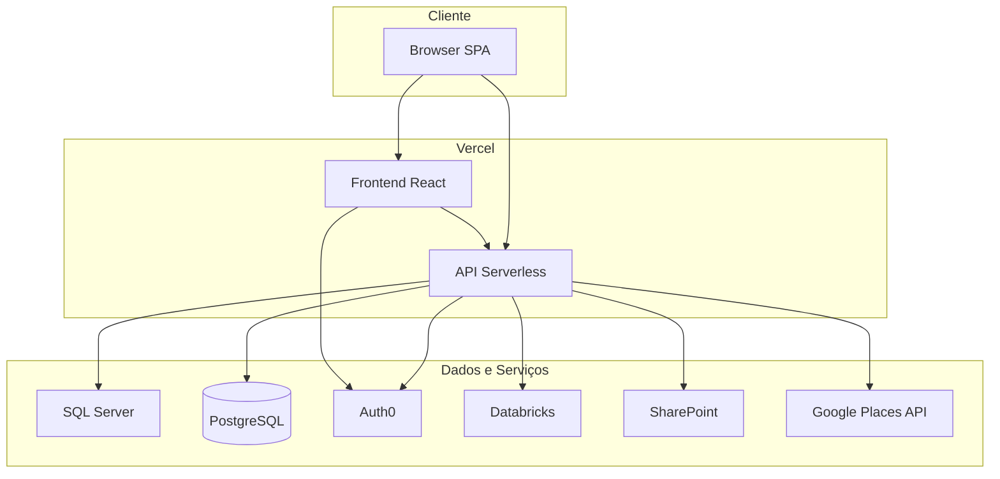
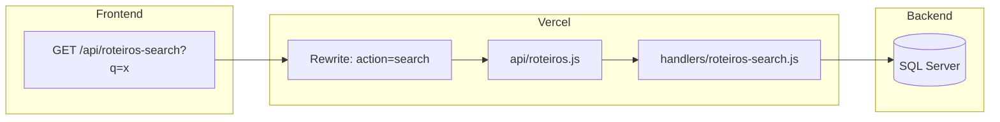
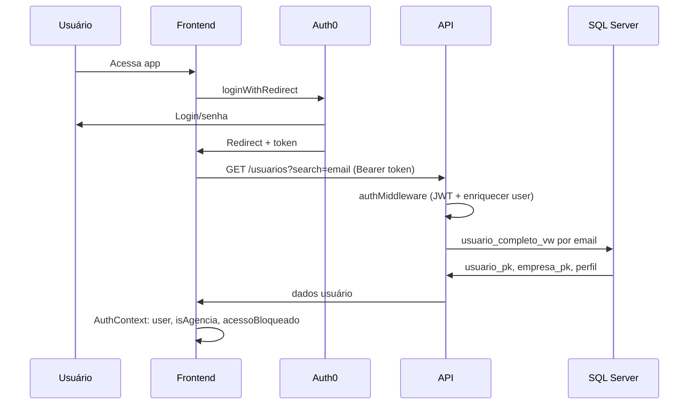
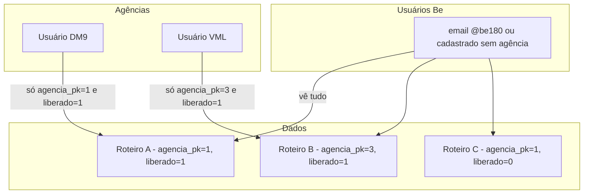
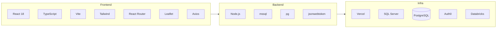

# Blueprint Colmeia — Apresentação (Escopo, Engenharia, Arquitetura e SaaS)

Documento único para copiar no Notion. Inclui diagramas em Mermaid (Notion suporta Mermaid em blocos de código ou integrações).

---

## 1. Visão geral do produto

**Colmeia - Meus Roteiros** é um sistema de gestão de roteiros de mídia OOH (Out of Home) desenvolvido pela Be Mediatech. Permite à Be e, em modelo SaaS, a agências externas parceiras, visualizar e operar planos de mídia, mapas, relatórios e banco de ativos em uma aplicação 100% serverless na Vercel.

**Principais capacidades:**

- Listagem, busca e gestão de roteiros (planos de mídia por grupo)
- Criação e edição de roteiros (simulado e completo), com integração Databricks
- Mapa interativo (Leaflet) com pontos de mídia, hexágonos e inventário por cidade
- Banco de ativos: dashboard, relatórios por praça/exibidor, importação e consulta de endereços/coordenadas
- Administração: usuários, perfis e permissões por área
- **Acesso externo (SaaS):** agências vinculadas veem apenas roteiros liberados para sua agência

---

## 2. Escopo de trabalho (módulos e funcionalidades)

| Módulo | Funcionalidades |
|--------|-----------------|
| **Meus Roteiros** | Listagem paginada, busca, status, exclusão (soft delete), toggle de liberação para agência, link para mapa e visualização de resultados |
| **Criar Roteiro** | Fluxo em abas: configuração, target, praças, envio; roteiro simulado com importação de plano OOH via Excel (template) e inserção via SP |
| **Mapa** | Cidades, semanas, hexágonos, pontos de mídia, inventário por cidade (por grupo de roteiro) |
| **Visualizar Resultados** | Detalhamento do roteiro após processamento |
| **Banco de Ativos** | Dashboard, mapa, busca de pontos, relatório por praça, relatório por exibidor |
| **Consulta Endereço** | Coordenadas → Endereço (reverse geocoding) e Endereço → Coordenadas (forward geocoding com upload Excel) |
| **Administração** | CRUD usuários (com vínculo opcional a agência), CRUD perfis, permissões por área (ler/escrever) |
| **Autenticação e acesso** | Login Auth0, callback, controle por domínio (@be180.com.br) e cadastro no banco, bloqueio de não autorizados, multi-tenant por agência |

Backend: 10 routers serverless (Vercel) que despacham para ~70 handlers; dados em SQL Server (principal), PostgreSQL (banco de ativos), Databricks (jobs), SharePoint e Google Places conforme necessidade.

---

## 3. Arquitetura — diagramas Mermaid

### 3.1 Arquitetura de alto nível (componentes e deploy)



### 3.2 Fluxo de request (rewrites e routers)



### 3.3 Autenticação e autorização (Auth0 + banco)



### 3.4 Controle de acesso (domínio e cadastro)

```mermaid
flowchart TD
  Start[Login Auth0 OK] --> Email{Email}
  Email -->|@be180.com.br| AllowBe[Acesso Be interno]
  Email -->|Outro domínio| BuscaDB[Busca no banco]
  BuscaDB --> Found{Cadastrado em usuario_dm?}
  Found -->|Sim| Empresa{empresa_pk}
  Empresa -->|Null| AllowBe
  Empresa -->|Preenchido| AllowAgencia[Acesso Agência]
  Found -->|Não| Block[Acesso bloqueado / AcessoNegado]
  AllowBe --> App[App completa]
  AllowAgencia --> AppRestrita[App restrita: Meus Roteiros + Mapa]
  Block --> Logout[Botão Voltar ao Login]
```

### 3.5 Modelo SaaS — multi-tenant por agência



### 3.6 Stack técnica (containers)



---

## 4. Engenharia

- **Frontend:** React 18, TypeScript, Vite, Tailwind CSS, React Router DOM, Leaflet (mapas), Axios, Auth0 React SDK, xlsx (leitura/geração Excel).
- **Backend:** Node.js em Vercel Serverless Functions; 10 routers em `api/` (roteiros, plano-midia, uploads, databricks, mapa, reports, banco-ativos, referencia, admin, integracoes); ~70 handlers em `handlers/`; `auth-middleware.js` para JWT e enriquecimento de usuário (usuario_pk, empresa_pk) com cache; conexões SQL Server (`db.js`) e PostgreSQL (banco de ativos).
- **Infra:** Vercel (hosting + serverless, region iad1, maxDuration 600s), rewrites em `vercel.json` mapeando URLs amigáveis para `?action=`. Variáveis de ambiente para DB, Auth0, Databricks, Azure/SharePoint, Google.
- **Segurança:** Autenticação Auth0; validação de acesso por email (domínio @be180.com.br ou cadastro no banco); agências só acessam dados filtrados por `agencia_pk` e `liberadoAgencia_bl`; endpoints de escrita protegidos com `requireInternalUser` onde aplicável.

---

## 5. Acesso externo (SaaS) — detalhes

**Conceito:** O Colmeia funciona como SaaS para agências: cada roteiro pertence a uma agência (`agencia_pk`); usuários Be podem "liberar" roteiros para visualização pela agência (`liberadoAgencia_bl`). Usuários de agência só veem roteiros da própria agência que estejam liberados.

**Cadastro:** No Admin (Gerenciar Usuários), o usuário Be associa o usuário a uma **Agência** (empresa_pk). O mesmo email deve existir no Auth0 para login.

**Liberação:** Em Meus Roteiros, apenas usuários Be veem a coluna "Agência" com um toggle por linha; ao ativar, o roteiro fica visível para os usuários daquela agência.

**Restrição de UI e API:** Para usuários com `empresa_pk` preenchido (agência): sidebar mostra apenas Meus Roteiros e Mapa; rotas como Criar Roteiro, Banco de Ativos, Consulta Endereço e Admin são `internalOnly` (redirecionam para home). Listagens de roteiros (list e search) e roteiro-completo aplicam filtro `agencia_pk = req.user.empresa_pk AND liberadoAgencia_bl = 1`. Delete e liberar-agência são restritos a usuários internos.

**Controle de quem entra:** Apenas (1) emails @be180.com.br ou (2) emails cadastrados em `usuario_dm` têm acesso; demais veem a tela "Acesso não autorizado" e podem usar o botão para voltar ao login (logout Auth0).

---

## 6. Estrutura de pastas (resumida)

- **api/** — 10 routers serverless (roteiros, plano-midia, uploads, databricks, mapa, reports, banco-ativos, referencia, admin, integracoes).
- **handlers/** — Lógica de negócio (~70 handlers), `db.js`, `auth-middleware.js`.
- **src/** — `components/`, `screens/`, `hooks/`, `contexts/` (AuthContext), `config/`, `icons/`, `utils/`.
- **vercel.json** — rewrites para SPA e para cada endpoint da API com `?action=`.
- **scripts/** — Scripts SQL de referência (ex.: alterações para liberadoAgencia_bl).

---

## 7. Como usar este blueprint no Notion

1. Criar uma página "Blueprint Colmeia" no Notion.
2. Colar cada seção acima; para diagramas, criar blocos de código e escolher linguagem "Mermaid" (se o Notion tiver suporte) ou usar uma integração de diagramas Mermaid e inserir as imagens.
3. Ajustar títulos e formatação (tabelas, listas) conforme o padrão do Notion.
4. Opcional: adicionar screenshots das telas (Login, Meus Roteiros, Admin, Acesso Negado) para enriquecer a apresentação.
