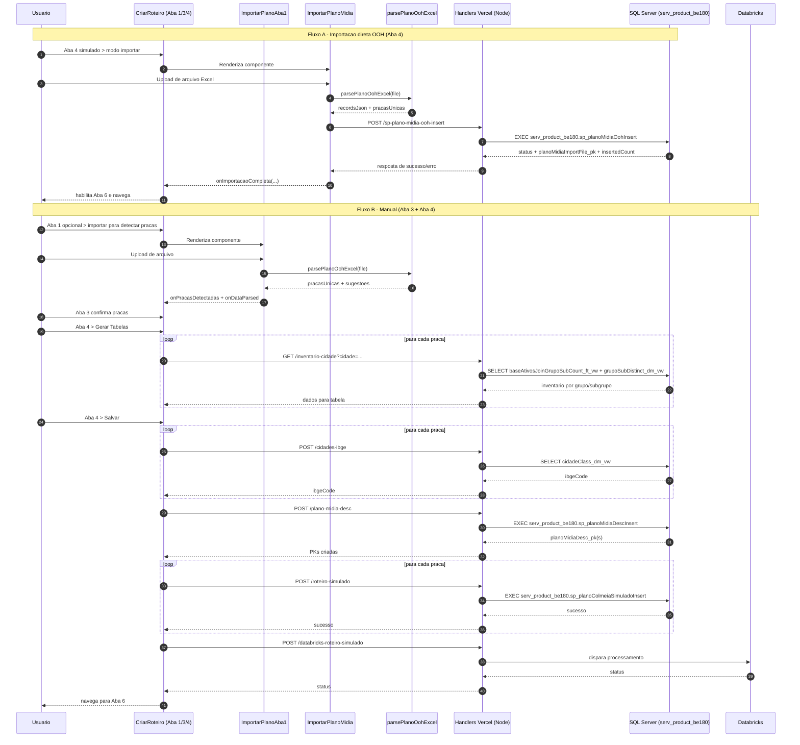

# Fluxo de Importacao OOH - Roteiro Simulado (Handoff Data Engineering)

## Objetivo

Documentar o fluxo completo de importacao de plano de midia OOH no modulo de criacao de roteiro simulado, incluindo:

- caminho de importacao direta na Aba 4
- caminho manual com configuracao de vias publicas
- endpoints, handlers, views e stored procedures envolvidos
- formato dos payloads e regras de filtro
- pontos criticos identificados e correcoes aplicadas

---

## Visao Geral dos Caminhos

Existem dois caminhos no simulado:

1. **Importacao direta OOH (Aba 4, modo "Importar Plano de Midia OOH")**
   - Front envia `recordsJson` para `POST /sp-plano-midia-ooh-insert`
   - Handler executa `serv_product_be180.sp_planoMidiaOohInsert`
   - Persistencia principal ocorre dentro da SP

2. **Fluxo manual (Aba 3 + Aba 4)**
   - Pracas configuradas na Aba 3
   - Inventario por praca carregado na Aba 4
   - Front cria `planoMidiaDesc_pk` e salva dados por praca via `POST /roteiro-simulado`
   - SP principal: `serv_product_be180.sp_planoColmeiaSimuladoInsert`

---

## Diagrama de Sequencia

---

## Frontend - Pontos de Entrada

### Tela principal

- `src/screens/CriarRoteiro/CriarRoteiro.tsx`
  - controla modo `simulado`
  - alterna entre `manual` e `importar`
  - dispara chamadas de API para persistencia e processamento

### Componentes de importacao

- `src/components/ImportarPlanoAba1/ImportarPlanoAba1.tsx`
  - parse inicial para detectar pracas e preencher sugestoes
- `src/components/ImportarPlanoMidia/ImportarPlanoMidia.tsx`
  - importacao direta para SP OOH na Aba 4

### Parser Excel

- `src/utils/parsePlanoOohExcel.ts`
  - le aba `OOH`
  - converte cabecalhos para chaves internas
  - calcula `_willInsert` por regra de negocio

---

## Back-end APIs e Objetos SQL

## Fluxo A - Importacao direta OOH

### Endpoint

- `POST /sp-plano-midia-ooh-insert`
- Handler: `handlers/sp-plano-midia-ooh-insert.js`

### Entrada esperada

- `recordsJson` (array, obrigatorio)
- `planoMidiaGrupo_pk` (obrigatorio)
- `filename_st` (opcional)
- `source_st` (opcional)
- `firstWeekStart_dt` (opcional)

### Acao SQL

- executa: `serv_product_be180.sp_planoMidiaOohInsert`

### Observacoes

- tratamento explicito de erro de chave duplicada (ex. SQL 2627)
- referencias de erro indicam envolvimento de entidades como `planoMidiaImportWeek_dm` e `processLogs_dm` dentro da SP

---

## Fluxo B - Simulado manual (Aba 3 + Aba 4)

### 1) Inventario por praca

- `GET /inventario-cidade?cidade=...`
- Handler: `handlers/inventario-cidade.js`
- SQL:
  - `serv_product_be180.baseAtivosJoinGrupoSubCount_ft_vw` (fonte)
  - `serv_product_be180.grupoSubDistinct_dm_vw` (descricao)

### 2) Resolucao de IBGE

- `POST /cidades-ibge`
- Handler: `handlers/cidades-ibge.js`
- SQL:
  - `serv_product_be180.cidadeClass_dm_vw`

### 3) Criacao de planoMidiaDesc por praca

- `POST /plano-midia-desc`
- Handler: `handlers/plano-midia-desc.js`
- SQL:
  - `EXEC [serv_product_be180].[sp_planoMidiaDescInsert]`

### 4) Persistencia do simulado por praca

- `POST /roteiro-simulado`
- Handler: `handlers/roteiro-simulado.js`
- SQL:
  - `EXEC serv_product_be180.sp_planoColmeiaSimuladoInsert`

### 5) Processamento analitico

- `POST /databricks-roteiro-simulado`
- objetivo: processamento e materializacao para resultados/mapa

---

## Regras de parse (Excel OOH)

Arquivo: `src/utils/parsePlanoOohExcel.ts`

### Regras principais

- aba alvo: `OOH` (fallback para primeira aba)
- mapping dinamico de colunas por cabecalho normalizado
- semanas detectadas por posicao (week01..week52)
- conversao de numeros e datas (inclui formato BR `dd/mm/yyyy`)

### Criterio `_willInsert`

Uma linha e marcada como inserivel quando:

- grupo 1 possui ao menos um de: `job_st` ou `campanha_st` ou `produto_st`
- grupo 2 possui ao menos um de: `inicio_dt` ou `termino_dt` ou alguma `weekXX_vl`
- grupo 3 possui ao menos um de: `grupo_st` ou `exibidor_st` ou `formato_st`

---

## Problemas Reais Encontrados e Correcoes

### 1) Pracas nao apareciam na busca (ex. Sao Paulo)

- causa:
  - filtro front sensivel a acento
  - limite de retorno baixo em `/cidades-praca`
- correcao:
  - normalizacao accent-insensitive na busca da Aba 3
  - aumento de `TOP` em `handlers/cidades-praca.js`

### 2) Inventario zerado para pracas com acento

- causa:
  - comparacao exata em `WHERE inv.cidade_st = @cidade`
- correcao:
  - comparacao com `COLLATE Latin1_General_CI_AI` + `UPPER/LTRIM/RTRIM`

### 3) Duplicacao de tabelas por praca na Aba 4

- causa:
  - chave de `tabelaSimulado` baseada em `Number(id_cidade)`; IDs textuais viravam `NaN`, gerando colisao
- correcao:
  - chave estavel em string por praca
  - leitura/escrita da tabela unificada por chave textual

---

## Confirmacao de Banco (Source of Truth)

O fluxo documentado acima roda em **SQL Server** (nao Postgres) para importacao e simulado principal:

- conexao via `handlers/db.js` com driver `mssql`
- host configurado por `DB_SERVER` no `.env`
- schema alvo: `serv_product_be180`

Observacao: existe uso de `pg` em outras rotas de enriquecimento especifico, mas nao no core da importacao OOH direta e persistencia principal do simulado descrita aqui.

---

## Checklist de Validacao para Data Engineer

- validar execucao de `sp_planoMidiaOohInsert` com payload de producao
- validar idempotencia/reimport (chaves duplicadas)
- validar consistencia de cidade/praca entre:
  - `bancoAtivosJoin_ft`
  - `baseAtivosJoinGrupoSubCount_ft_vw`
  - `cidadeClass_dm_vw`
- validar cardinalidade por praca antes/depois de `sp_planoColmeiaSimuladoInsert`
- validar integracao final com processamento Databricks

---

## Referencias de Codigo

- `src/screens/CriarRoteiro/CriarRoteiro.tsx`
- `src/components/ImportarPlanoAba1/ImportarPlanoAba1.tsx`
- `src/components/ImportarPlanoMidia/ImportarPlanoMidia.tsx`
- `src/utils/parsePlanoOohExcel.ts`
- `handlers/sp-plano-midia-ooh-insert.js`
- `handlers/inventario-cidade.js`
- `handlers/cidades-ibge.js`
- `handlers/plano-midia-desc.js`
- `handlers/roteiro-simulado.js`
- `handlers/db.js`

