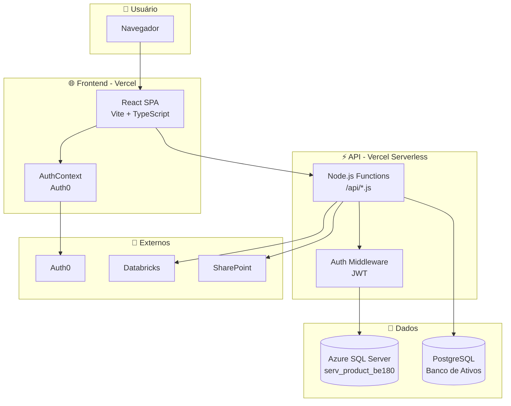
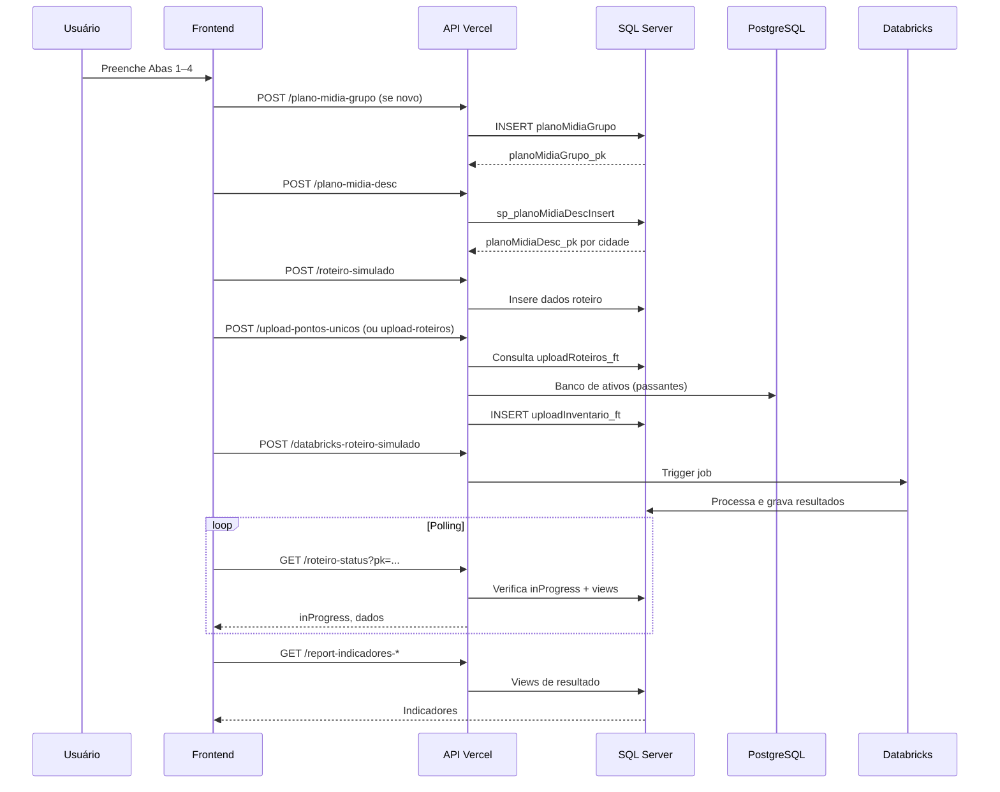
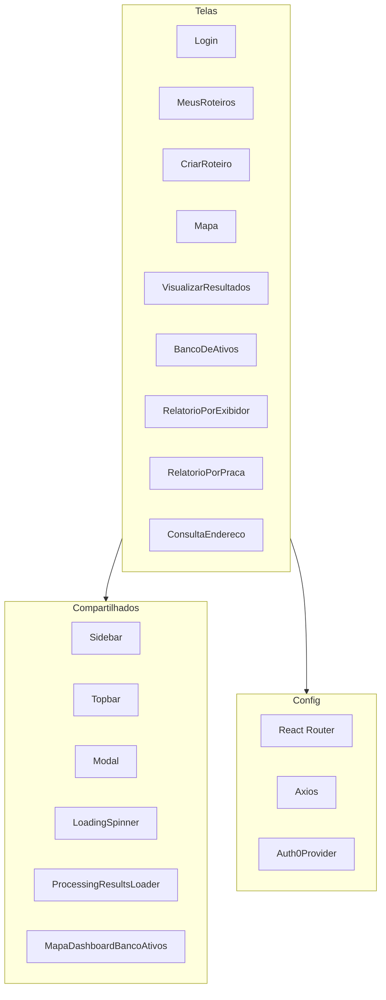
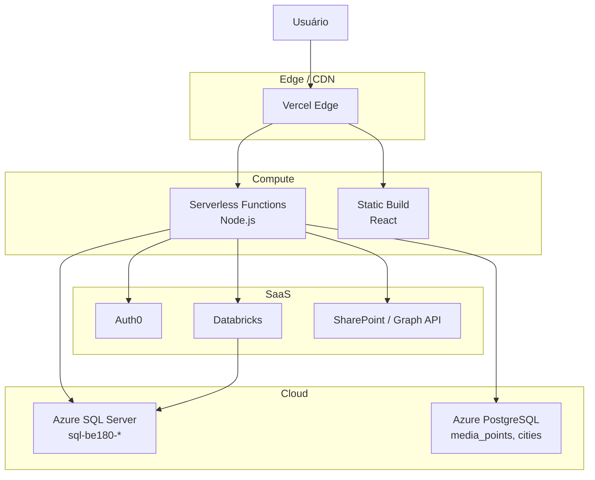
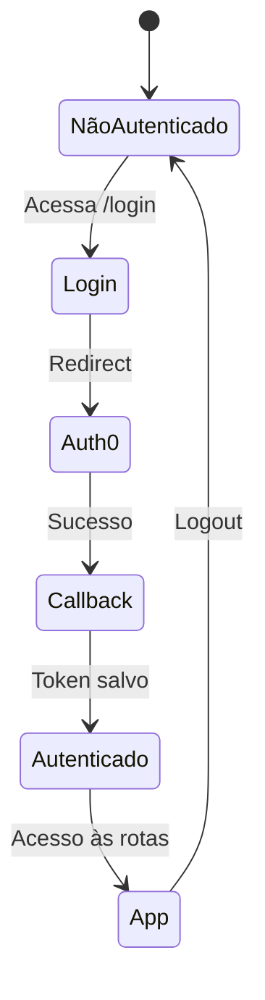
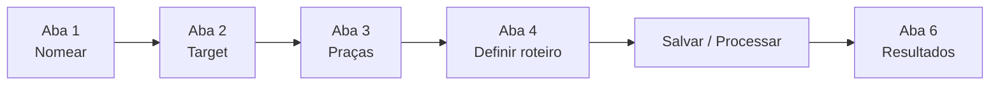
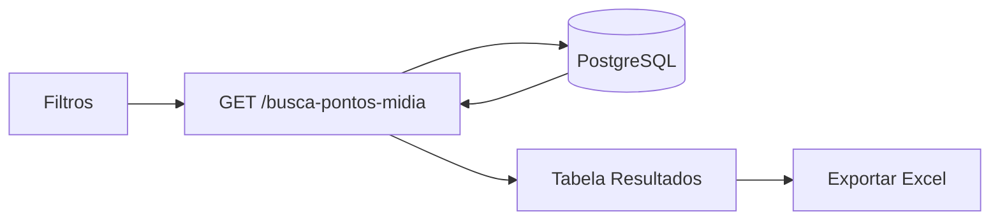

# 🍯 Colmeia — White Paper do Produto

> **Documento de referência do sistema Colmeia**  
> Arquitetura, regras de negócio, fluxos e documentação técnica.  
> Formato Notion-ready • Última atualização: Janeiro 2026

---

> **💡 No Notion:** Cole este arquivo em uma página; headers, tabelas e listas são convertidos automaticamente. Para **diagramas Mermaid**, use o bloco `/code`, escolha a linguagem **Mermaid** e cole o conteúdo do diagrama (ou use um embed de [mermaid.live](https://mermaid.live) exportando como PNG/SVG).

---

## 📑 Índice

1. [Visão Executiva](#1-visão-executiva)
2. [Visão do Produto](#2-visão-do-produto)
3. [Regras de Negócio](#3-regras-de-negócio)
4. [Arquitetura do Sistema](#4-arquitetura-do-sistema)
5. [Modelo de Dados](#5-modelo-de-dados)
6. [Fluxos Principais](#6-fluxos-principais)
7. [Módulos e Funcionalidades](#7-módulos-e-funcionalidades)
8. [Integrações](#8-integrações)
9. [Segurança e Autenticação](#9-segurança-e-autenticação)
10. [Stack Técnico](#10-stack-técnico)
11. [Referência de APIs](#11-referência-de-apis)
12. [Deploy e Infraestrutura](#12-deploy-e-infraestrutura)

---

## 1. Visão Executiva

**Colmeia** é uma plataforma de gestão de roteiros de mídia OOH (Out of Home), desenvolvida para planejamento, simulação e análise de campanhas. O sistema integra:

- **Planejamento** — Criação de roteiros (simulado e completo) com múltiplas praças, target e semanas.
- **Banco de ativos** — Inventário de pontos de mídia, busca por filtros e relatórios por exibidor e praça.
- **Processamento** — Enriquecimento com dados de passantes (API) e processamento em Databricks para indicadores.
- **Resultados** — Dashboards, relatórios e exportação (Excel, SharePoint).

**Principais características:**

| Característica | Descrição |
|----------------|-----------|
| **100% Serverless** | Frontend e API hospedados na Vercel |
| **Multi-banco** | SQL Server (principal) + PostgreSQL (banco de ativos) |
| **Auth0** | Autenticação centralizada com JWT |
| **Databricks** | Jobs para cálculo de indicadores e resultados |

---

## 2. Visão do Produto

### 2.1 O que é Colmeia?

Colmeia permite que usuários:

1. **Criem roteiros** — Nomear projeto (agência, marca, categoria, target), selecionar praças e configurar grupos de mídia por cidade.
2. **Definam o roteiro** — Tabela por praça com visibilidade (estático), inserções digitais, total de ativos e semanas.
3. **Enviem para processamento** — Upload de pontos, enriquecimento com passantes e disparo do job Databricks.
4. **Visualizem resultados** — Aba de resultados com indicadores (impactos, cobertura, GRP, etc.) e exportação.

### 2.2 Personas e casos de uso

| Persona | Caso de uso principal |
|---------|------------------------|
| **Planejador de mídia** | Criar roteiro simulado, definir semanas e grupos, visualizar resultados |
| **Gestor de inventário** | Buscar pontos no banco de ativos, filtrar por praça/exibidor/bairro/tipo, exportar Excel |
| **Analista** | Consultar relatórios por exibidor e por praça, baixar Excel do SharePoint |

---

## 3. Regras de Negócio

### 3.1 Roteiro e plano de mídia

- **planoMidiaGrupo** — Representa um “roteiro” (projeto). Contém nome, agência, marca, categoria e target.
- **planoMidiaDesc** — Uma “descrição” por combinação cidade + target (sexo, faixa etária, etc.). Cada cidade selecionada gera um ou mais `planoMidiaDesc_pk`.
- **Praças** — Cidades vinculadas ao grupo; o sistema busca código IBGE para integração com Databricks.
- **Semanas** — Quantidade de semanas é definida na criação; as colunas dinâmicas na tabela refletem essas semanas.

### 3.2 Roteiro simulado vs roteiro completo

| Tipo | Descrição | Fonte dos pontos |
|------|-----------|------------------|
| **Simulado** | Planejamento com dados do inventário da cidade (grupos/subgrupos). | API `inventario-cidade` + tabela definida pelo usuário |
| **Completo** | Pontos reais carregados via Excel (lat/long, ambiente, tipo). | Upload Excel → `uploadRoteiros` → `uploadRoteiros_ft` |

### 3.3 Grupos e tipos de mídia

- **Grupos** — Filtrados para não incluir os que começam com `P` (ex.: grupos de teste).
- **Estático vs Digital** — Identificado por `estaticoDigital_st` (`E` = Estático, `D` = Digital).
- **Visibilidade** — Campo “Deflator de visibilidade” (Baixa/Média/Moderada/Alta) aplica-se **apenas a pontos estáticos**; para digital exibe “N/A”.
- **Digital** — Campos “Inserções” e “Máx. Inserções” aplicam-se a pontos digitais.

### 3.4 Banco de ativos

- **Busca de pontos** — Filtros: Praça, Exibidor, Bairro, Rating, Ambiente, Grupo de mídia, Tipo (Indoor / Vias Públicas), Formato.
- **Filtros encadeados** — Opções de Praça, Exibidor e Bairro podem ser restritas conforme outros filtros selecionados.
- **Relatórios** — Por exibidor e por praça, com ordenação e exportação Excel (colunas Bairro e Cidade separadas).

### 3.5 Processamento e resultados

- **Passantes** — Pontos do roteiro são enriquecidos via API de banco de ativos (passantes por coordenada).
- **Databricks** — Job é disparado após persistência do roteiro; processa dados e grava resultados no SQL Server.
- **Status** — Polling em `roteiro-status` até `inProgress_bl = 0` e existência de dados nas views de resultado.
- **Resultados** — Indicadores agregados (impactos, cobertura, GRP, etc.) consumidos por endpoints `report-indicadores-*`.

### 3.6 Consulta de endereço

- Upload de Excel com colunas de latitude/longitude.
- Reverse geocoding (Google ou Nominatim) para obter endereço completo e CEP.
- Download de Excel enriquecido.

---

## 4. Arquitetura do Sistema

### 4.1 Visão geral (alto nível)



### 4.2 Arquitetura em camadas

```mermaid
flowchart LR
    subgraph Presentation["Apresentação"]
        A1[Login]
        A2[Meus Roteiros]
        A3[Criar Roteiro]
        A4[Mapa]
        A5[Banco de Ativos]
        A6[Relatórios]
        A7[Consulta Endereço]
    end

    subgraph Application["Aplicação"]
        B1[AuthContext]
        B2[Hooks / State]
        B3[Axios / API Client]
    end

    subgraph API_Layer["API Layer"]
        C1[Serverless Functions]
        C2[Auth Middleware]
        C3[DB Pool SQL]
        C4[Postgres Pool]
    end

    subgraph Domain["Domínio / Dados"]
        D1[(SQL Server)]
        D2[(PostgreSQL)]
        D3[Databricks]
        D4[Auth0]
        D5[SharePoint]
    end

    Presentation --> Application
    Application --> API_Layer
    API_Layer --> Domain
```



### 4.3 Fluxo de dados — Criação de roteiro



### 4.4 Componentes do frontend



### 4.5 Infraestrutura



---

## 5. Modelo de Dados

### 5.1 SQL Server (principal)

**Schema:** `serv_product_be180`

| Entidade / View | Uso |
|-----------------|-----|
| `planoMidiaGrupo_dm_vw` | Roteiros (lista, busca, delete). Campos: pk, planoMidiaGrupo_st, delete_bl |
| `planoMidiaDesc_dm` / SP | Descrições por cidade/target; SP `sp_planoMidiaDescInsert` |
| `planoMidia_dm_vw` | Plano de mídia; planoMidiaDescPk_st (concatenação de PKs) |
| `uploadRoteiros_ft` | Pontos carregados por upload (ambiente, tipoMidia, lat/long) |
| `uploadInventario_ft` | Inventário enriquecido (fluxo passantes, date_dh) |
| `baseCalculadoraLastPlanoMidia_ft_vw` | Base para cálculo; usado em mapa e pontos |
| `baseAtivosJoinGrupoSubCount_ft_vw` | Inventário por cidade (grupo, subgrupo, count) |
| `grupoSubDistinct_dm_vw` | Grupos/subgrupos (descrição, cores, ativo) |
| `marca_dm` / `marca_dm_vw` | Marcas (leitura + insert) |
| Views de report | `report-indicadores-*` (vias públicas, summary, target, week, etc.) |

### 5.2 PostgreSQL (banco de ativos)

| Tabela | Uso |
|--------|-----|
| `media_points` | Pontos de mídia (lat, long, passantes, rating, etc.) |
| `cities` | Cidades |
| `media_exhibitors` | Exibidores |
| `media_types` | Tipos de mídia |
| `media_groups` | Grupos de mídia |

### 5.3 Diagrama ER simplificado

```mermaid
erDiagram
    planoMidiaGrupo_dm ||--o{ planoMidiaDesc_dm : "tem"
    planoMidiaDesc_dm ||--o{ planoMidia_dm : "atualiza"
    uploadRoteiros_ft ||--o{ uploadInventario_ft : "gera"
    baseCalculadora_ft ||--o{ report_views : "alimenta"

    planoMidiaGrupo_dm {
        int pk PK
        string planoMidiaGrupo_st
        int delete_bl
    }

    planoMidiaDesc_dm {
        int pk PK
        int planoMidiaGrupo_pk FK
        string ibgeCode_vl
    }

    media_points {
        int id PK
        float latitude
        float longitude
        int city_id FK
    }
```

---

## 6. Fluxos Principais

### 6.1 Fluxo de autenticação



### 6.2 Fluxo Criar Roteiro (abas)



### 6.3 Fluxo Banco de Ativos — Busca



---

## 7. Módulos e Funcionalidades

### 7.1 Módulos principais

| Módulo | Rota(s) | Descrição |
|--------|---------|-----------|
| **Login** | `/login` | Tela de login Auth0 |
| **Meus Roteiros** | `/` | Listagem, busca, paginação, delete |
| **Criar Roteiro** | `/criar-roteiro` | Wizard em abas (nomear, target, praças, definir roteiro, resultados) |
| **Mapa** | `/mapa` | Mapa com pontos do roteiro (hexágonos, fluxo) |
| **Visualizar Resultados** | (dentro de Criar Roteiro) | Aba 6: indicadores e download Excel |
| **Banco de Ativos** | (menu) | Dashboard + Busca de pontos + mapa |
| **Relatório por Exibidor** | (menu) | Tabela ordenável, Bairro/Cidade separados, export Excel |
| **Relatório por Praça** | (menu) | Relatório por praça |
| **Consulta Endereço** | `/consulta-endereco` | Upload Excel lat/long → endereço + CEP |

### 7.2 Funcionalidades por tela (resumo)

- **Criar Roteiro:** Agência, Marca (com “adicionar marca”), Categoria, Target (gênero, faixa etária, classe), Praças, Tabela por grupo/subgrupo (visibilidade só estático, inserções digital, semanas), Upload Excel (roteiro completo), Download template, Integração Databricks, Polling de status, Resultados e exportação.
- **Banco de Ativos:** Dashboard (totais, vias públicas, indoor), Busca com filtros encadeados, Export Excel, Mapa.
- **Relatórios:** Ordenação por colunas, Bairro e Cidade em colunas separadas, Export Excel.

---

## 8. Integrações

### 8.1 Auth0

- Login/logout e callback.
- Variáveis: `VITE_AUTH0_DOMAIN`, `VITE_AUTH0_CLIENT_ID`, `AUTH0_CLIENT_SECRET`, callback e logout URLs.
- JWT validado no auth middleware das APIs quando necessário.

### 8.2 Azure SQL Server

- Conexão via `mssql` (pool em `db.js`).
- Variáveis: `DB_SERVER`, `DB_DATABASE`, `DB_USER`, `DB_PASSWORD`.
- Timeouts configurados para operações longas.

### 8.3 PostgreSQL (banco de ativos)

- Uso em: busca de pontos, dashboard, relatórios, mapa (quando aplicável).
- Pool próprio nos endpoints que acessam esse banco.

### 8.4 Databricks

- Jobs disparados pela API (ex.: `databricks-roteiro-simulado`, `databricks-run-job`).
- Processamento fora da Vercel; resultados gravados no SQL Server.

### 8.5 SharePoint / Microsoft Graph

- Download de Excel do SharePoint por `planoMidiaGrupo_pk`.
- Variáveis: `AZURE_TENANT_ID`, `AZURE_CLIENT_ID`, `AZURE_CLIENT_SECRET`, `SHAREPOINT_SITE_URL`, etc.

### 8.6 Consulta de endereço (Geocoding)

- API `consulta-endereco`: recebe array de coordenadas.
- Provedores: Google Geocoding API (se configurado) ou Nominatim (fallback).
- Retorno: endereço formatado, logradouro, número, bairro, cidade, estado, CEP, país.

---

## 9. Segurança e Autenticação

- **Auth0:** provedor de identidade; tokens JWT para o frontend.
- **Rotas protegidas:** checagem de autenticação no cliente; APIs sensíveis podem usar auth middleware.
- **Variáveis sensíveis:** em `.env` (local) e Environment Variables (Vercel); não versionadas.
- **HTTPS:** em produção (Vercel).
- **CORS e origens:** configuradas conforme Auth0 e frontend URL.

---

## 10. Stack Técnico

| Camada | Tecnologia |
|--------|------------|
| **Frontend** | React 18, TypeScript, Vite, Tailwind CSS, React Router, Leaflet (mapa), Axios |
| **Auth** | Auth0 (React SDK), JWT |
| **API** | Node.js (Vercel Serverless), Express implícito |
| **Banco principal** | Azure SQL Server, driver `mssql` |
| **Banco ativos** | PostgreSQL, driver `pg` |
| **Processamento** | Databricks (jobs externos) |
| **Hosting** | Vercel (frontend + serverless functions) |
| **Integrações** | Microsoft Graph (SharePoint), Google/Nominatim (geocoding) |

---

## 11. Referência de APIs

### 11.1 Autenticação e usuário

| Método | Endpoint | Descrição |
|--------|----------|-----------|
| GET | `/api/user-profile` | Perfil do usuário (quando aplicável) |

### 11.2 Roteiros e plano de mídia

| Método | Endpoint | Descrição |
|--------|----------|-----------|
| GET | `/api/roteiros` | Lista roteiros (paginado) |
| GET | `/api/roteiros-search` | Busca por nome |
| DELETE | `/api/roteiros-delete` | Remove roteiro |
| GET | `/api/roteiro-status` | Status do processamento (polling) |
| POST | `/api/plano-midia-grupo` | Cria/atualiza grupo |
| POST | `/api/plano-midia-desc` | Cria descrições (cidades/target) |
| POST | `/api/roteiro-simulado` | Salva dados do roteiro simulado |
| POST | `/api/upload-roteiros` | Upload de roteiros (Excel) |
| POST | `/api/upload-pontos-unicos` | Processa pontos únicos e enriquece |
| GET | `/api/pivot-descpks` | Pivot de desc PKs |
| GET | `/api/semanas` | Semanas por desc_pk |

### 11.3 Cadastros e filtros

| Método | Endpoint | Descrição |
|--------|----------|-----------|
| GET / POST | `/api/marca` | Lista ou cria marca |
| GET | `/api/agencia` | Agências |
| GET | `/api/categoria` | Categorias |
| GET | `/api/cidades-praca` | Praças (cidades) |
| GET | `/api/inventario-cidade` | Inventário por cidade (grupos/subgrupos) |
| GET | `/api/grupo-sub-distinct` | Grupos/subgrupos distintos |
| GET | `/api/target-genero` | Gênero |
| GET | `/api/target-faixa-etaria` | Faixa etária |
| GET | `/api/target-classe` | Classe |

### 11.4 Banco de ativos

| Método | Endpoint | Descrição |
|--------|----------|-----------|
| GET | `/api/banco-ativos-dashboard` | Totais (pontos, praças, exibidores) |
| GET | `/api/busca-pontos-midia` | Busca pontos com filtros |
| GET | `/api/bairros` | Bairros |
| GET | `/api/exibidores` | Exibidores |
| GET | `/api/grupos-midia` | Grupos de mídia |
| GET | `/api/tipos-midia-indoor` | Tipos indoor |
| GET | `/api/tipos-midia-vias-publicas` | Tipos vias públicas |
| GET | `/api/banco-ativos-mapa` | Dados para mapa |
| GET | `/api/banco-ativos-relatorio-exibidor` | Relatório por exibidor |
| GET | `/api/banco-ativos-relatorio-praca` | Relatório por praça |

### 11.5 Resultados e relatórios

| Método | Endpoint | Descrição |
|--------|----------|-----------|
| POST | `/api/report-indicadores-vias-publicas` | Dados vias públicas |
| POST | `/api/report-indicadores-summary` | Resumo indicadores |
| POST | `/api/report-indicadores-target` | Indicadores target |
| POST | `/api/report-indicadores-target-summary` | Resumo target |
| POST | `/api/report-indicadores-week` | Indicadores por semana |
| POST | `/api/report-indicadores-week-summary` | Resumo semanal |
| POST | `/api/report-indicadores-week-target` | Semanal target |
| POST | `/api/report-indicadores-week-target-summary` | Resumo semanal target |

### 11.6 Processamento e integrações

| Método | Endpoint | Descrição |
|--------|----------|-----------|
| POST | `/api/databricks-roteiro-simulado` | Dispara job Databricks roteiro simulado |
| POST | `/api/databricks-run-job` | Dispara job Databricks genérico |
| POST | `/api/consulta-endereco` | Reverse geocoding (lat/long → endereço) |
| GET | `/api/sharepoint-download` | Download Excel do SharePoint |

---

## 12. Deploy e Infraestrutura

- **Build:** `npm run build` (Vite).
- **Deploy:** Vercel (`vercel` / `vercel --prod`). APIs em `/api/*.js` viram serverless functions.
- **Variáveis de ambiente:** Definidas no projeto Vercel (e em `.env` local).
- **Rewrites:** `vercel.json` mapeia rotas SPA e APIs conforme documentado no projeto.
- **Timeout:** Funções com `maxDuration` até 600s onde necessário.

---

## 📎 Anexos

### Links úteis

| Descrição | URL |
|-----------|-----|
| **Jira — APP Backlog** | https://likeme-app.atlassian.net/jira/software/projects/APP/boards/1/backlog |

---

### Como usar este documento no Notion

1. Crie uma nova página no Notion.
2. Cole o conteúdo deste Markdown.
3. Notion converte headers, tabelas e listas automaticamente.
4. **Diagramas Mermaid:** use blocos de código com linguagem `mermaid` ou integre com app Mermaid no Notion (se disponível). Alternativa: exportar imagens dos diagramas e inserir como imagens.
5. Ajuste callouts com blocos de citação (quote) se quiser destacar trechos.

### Manutenção do documento

- Atualizar “Última atualização” no topo ao alterar o white paper.
- Revisar lista de APIs em `vercel.json` e em `api/` para manter a referência alinhada ao código.
- Regras de negócio devem ser atualizadas quando houver mudanças em fluxos ou validações.

---

*Documento gerado a partir do código e da documentação do projeto Colmeia — Be Mediatech OOH.*
